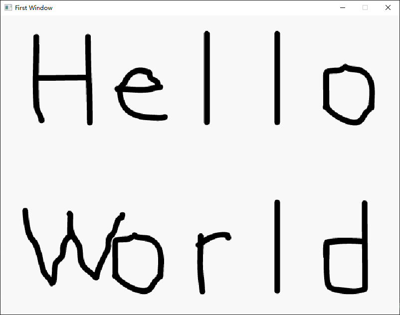
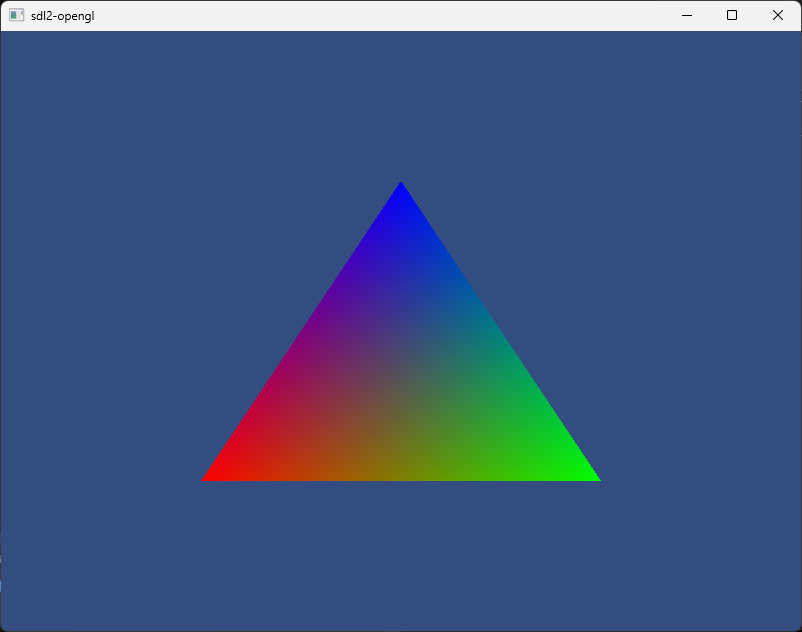

# ComputeDuck

A C-like syntax Scripting toy language  

<!-- PROJECT SHIELDS -->
[![Contributors][contributors-shield]][contributors-url]
[![Forks][forks-shield]][forks-url]
[![Stargazers][stars-shield]][stars-url]
[![Issues][issues-shield]][issues-url]
[![Apache-2.0 License][license-shield]][license-url]
<!-- PROJECT LOGO -->
<br />

## Environment
1. C++ compiler(>=17)
2. CMake(>=3.10)
3. Python(>=3.10)
4. C#(>=.NetCore 6.0)

#### Build
```sh
#run opengl example on linux,you need to install required libraries:
install opengl(linux only)
sudo apt-get install build-essential
sudo apt-get install libgl1-mesa-dev

install x11(linux only)
sudo apt-get install xorg
sudo apt-get install xauth
sudo apt-get install openbox
sudo apt-get install xserver-xorg-legacy
sudo apt install x11-apps -y
apt install libx11-dev libxext-dev libxtst-dev libxrender-dev libxmu-dev libxmuu-dev

# C++ build:
git clone https://github.com/Sqazine/ComputeDuck.git
git submodule update --init --recursive
mkdir build
cd build 
cmake ..
cmake -build .

# Python build:
# for sdl2.cd example
pip install pysdl2-dll==2.30.2
pip install PySDL2==0.9.16
# for sdl2-opengl example
pip install PyOpenGL==3.1.6
pip install PyOpenGL_accelerate==3.1.6
# or 
pip install -r otherImpl/python/requirements.txt

# C#(.NetCore 6.0) build:
#just open otherImpl/c#/ComputeDuck.sln
```

## Examples
#### Variable declaration
```sh
a=10;
b=a;
c;
b=20;
println(a);#10
println(b);#20
println(c);#nil
```
#### Function
```sh
add=function(x,y){
    return x+y;
};

c=add(1.000000,2.000000);
println(c);#3.000000

println("hello world!");#The function that outputs to the console

a=[1,2,3];#array
sizeof(a);#get the size of array
```
#### Array
```sh

add=function(vec1,vec2){
    return [vec1[0]+vec2[0],vec1[1]+vec2[1]];
};

sub=function(vec1,vec2){
    return [vec1[0]-vec2[0],vec1[1]-vec2[1]];
};

vec1=[3,3];
vec2=[2,2];

vec3=add(vec1,vec2);

println(vec3);#[5.000000,5.000000]
```

#### If-else
```sh
a=10;
b=a;
b=20;
println(a);#10.000000
println(b);#20.000000

if(b<a)
    b=a;
else 
{
    a=b;
}

println(a);#20.000000
println(b);#20.000000


if(a>100)
    a=100;
else if(a>50)
    a=50;
else if(a>30)
    a=30;
else a=5; 

println(a);#5.000000

if(b>a)
   if(a==100)
        a=1000;
    else 
        a=500;
else 
    a=300;

println(a);#500.000000
```

#### Loop
```sh
a=0;

while(a<100)
{
    println(a);
    a=a+1;
}

# 0.000000
#...
#...
#...
# 99.000000
```

#### Struct
```sh
struct Vec2
{
    x:0,
    y:0
}
struct Vec3
{
    vec2:Vec2,
    z:0
}
struct Vec4
{
    vec3:Vec3,
    w:0
}
a=Vec4;
a.vec3.vec2.x=1000;
println(a);
#struct
#{
#    vec3=struct
#         {
#            z=0.000000
#           vec2=struct
#                 {
#                    x=1000.000000
#                    y=0.000000
#                 }
#         }
#   w=0.000000
#}
println(a.vec3.vec2.x);# 1000.000000
```

#### LinkedList
```sh
struct Node
{
    v:0,
    next:nil,
}

head=Node;

e=head;
i=1;
while(i<10)
{
    e2=Node;
    e2.v=i;

    e.next=e2;

    e=e.next;

    i=i+1;
}

println(head);

#struct{
#  v=0.000000
#  next=struct
#  {
#    v=1.000000
#    next=struct
#    {
#      v=2.000000
#      next=struct
#      {
#        v=3.000000
#        next=struct
#        {
#          v=4.000000
#          next=struct
#          {
#            v=5.000000
#            next=struct
#            {
#              v=6.000000
#              next=struct
#              {
#                v=7.000000
#                next=struct
#                {
#                  v=8.000000
#                  next=struct
#                  {
#                    v=9.000000
#                    next=nil
#                  }
#                }
#              }
#            }
#          }
#        }
#      }
#    }
#  }
#}
```

#### Fibonacci numbers
```sh
fib=function(x)
{
    if(x==0) 
        return 0;
    else if(x==1) 
        return 1;
    else 
        return fib(x-1)+fib(x-2);
};
a=fib(10);
println(a);#55
```

#### OOP simulate
```sh
struct ShapeVtbl
{
    area:nil,
}

struct Shape
{
    vptr:ShapeVtbl,
    super,
    x:0,
    y:0;
}

ShapeCtor=function(self,x,y)
{
    self.x=x;
    self.y=y;
    self.vptr.area=lambda(self)
    {
        return 0;
    };
};

ShapeArea=function(self)
{
    if(self.super==nil)
        return self.vptr.area(self);
    return self.super.vptr.area(self);
};

s1=Shape;
ShapeCtor(ref s1,10,10);
println(s1);#struct instance Shape:
            #   vptr=struct instance ShapeVtbl:
            #       area=lambda:0
            #super=nil
            #x=10.0
            #y=10.0
println(ShapeArea(s1));#0.0


struct Rectangle
{
    super:Shape,
    width,
    height
}

RectangleCtor=function(self,x,y,w,h)
{
    ShapeCtor(self.super,x,y);
    self.width=w;
    self.height=h;
    self.super.vptr.area=lambda(self)
    {
        return self.width*self.height;
    };
};

r1=Rectangle;
RectangleCtor(ref r1,10,10,3,5);
println(r1);#struct instance Rectangle:
            #super=struct instance Shape:
            #        vptr=struct instance ShapeVtbl:
            #                area=lambda:1
            #        super=nil
            #        x=10.0
            #        y=10.0
            #width=3.0
            #height=5.0

println(ShapeArea(r1));#15
```

#### Anonymous Struct(similar to javascript's Object)
```sh
a={
    x:10,
    y:20
};

println(a);
#struct instance:
#{
#y:20.000000
#x:10.000000
#}

```

#### External file import
```sh
# vec2.cd
struct Vec2
{
    x:0,
    y:0
}

# vec3.cd 
import("vec2.cd");

struct Vec3
{
    vec2:Vec2,
    z:0
}

# vec4.cd
import("vec2.cd");
struct Vec4
{
    vec2:Vec2,
    z:0
    w:0
}

# vec5.cd
import("vec4.cd");
struct Vec5
{
    vec4:Vec4,
    j:0
}

# vec-import.cd 
import("vec3.cd");
import("vec4.cd");
import("vec2.cd");
import("vec5.cd");

a=Vec4;
b=Vec3;
c=Vec2;
d=Vec5;

println(a);
println(b);
println(c);
println(d);
```

14. Import 3th-party dll library
```sh
dllimport("sdl2");

ok=SDL_Init(SDL_INIT_VIDEO);
if(ok<0)
    println("Failed to init sdl2!");
window=SDL_CreateWindow("First Window",SDL_WINDOWPOS_CENTERED,SDL_WINDOWPOS_CENTERED,800,600);
isRunning=true;

renderer=SDL_CreateRenderer(window);

if(renderer==nil)
    println("Failed to create renderer.");

surface=SDL_LoadBMP("examples/hello.bmp");

if(surface==nil)
    println("Failed to load bmp image.");

texture=SDL_CreateTextureFromSurface(renderer,surface);

SDL_RenderClear(renderer);

SDL_RenderCopy(renderer,texture);

SDL_RenderPresent(renderer);

while(isRunning)
{
  event=SDL_PollEvent();
  if(event!=nil)
  {
      if(SDL_GetEventType(event)==SDL_QUIT)
      {
          isRunning=false;
      }
  }
}

SDL_Quit();
```



#### OpenGL example
```sh
dllimport("cdsdl2");
dllimport("cdopengl");

ok=SDL_Init(SDL_INIT_VIDEO);
if(ok<0)
    println("Failed to init sdl2!");
window=SDL_CreateWindow("sdl2-opengl",SDL_WINDOWPOS_CENTERED,SDL_WINDOWPOS_CENTERED,800,600,SDL_WINDOW_SHOWN|SDL_WINDOW_RESIZABLE|SDL_WINDOW_ALLOW_HIGHDPI|SDL_WINDOW_OPENGL);
isRunning=true;

positions=[-0.5,-0.5,0.0,
            0.5,-0.5,0.0,
            0.0,0.5,0.0];

colors=[1.0,0.0,0.0,
        0.0,1.0,0.0,
        0.0,0.0,1.0];

indices=[0,1,2];

vertShaderSrc="#version 330 core
            layout (location = 0) in vec3 position;
            layout (location = 1) in vec3 vColor;
            out vec3 color;
            void main()
            {
                gl_Position = vec4(position.x, position.y, position.z, 1.0);
                color=vColor;
            }";

fragShaderSrc="#version 330 core
            out vec4 FragColor;
            in vec3 color;
            void main()
            {
                FragColor = vec4(color.xyz,1.0);
            }";

SDL_GL_SetAttribute(SDL_GL_CONTEXT_PROFILE_MASK, SDL_GL_CONTEXT_PROFILE_COMPATIBILITY);
SDL_GL_SetAttribute(SDL_GL_RED_SIZE, 8);
SDL_GL_SetAttribute(SDL_GL_GREEN_SIZE, 8);
SDL_GL_SetAttribute(SDL_GL_BLUE_SIZE, 8);
SDL_GL_SetAttribute(SDL_GL_ALPHA_SIZE, 8);
SDL_GL_SetAttribute(SDL_GL_DOUBLEBUFFER, 1);
#not work on WSL2 linux subsystem,need to comment the follow two lines
SDL_GL_SetAttribute(SDL_GL_MULTISAMPLEBUFFERS, 1);
SDL_GL_SetAttribute(SDL_GL_MULTISAMPLESAMPLES, 1);

sdlGLCTX = SDL_GL_CreateContext(window);
success = SDL_GL_SetSwapInterval(1);

if (gladLoadGL()!=1)
	println("failed to load opengl");

vao=0;
glGenVertexArrays(1,ref vao);
glBindVertexArray(vao);

vbo=0;
glGenBuffers(1,ref vbo);
glBindBuffer(GL_ARRAY_BUFFER, vbo);  
glBufferData(GL_ARRAY_BUFFER, sizeof(positions)*4, positions, GL_STATIC_DRAW);
glBindBuffer(GL_ARRAY_BUFFER, 0);  

color_vbo=0;
glGenBuffers(1,ref color_vbo);
glBindBuffer(GL_ARRAY_BUFFER, color_vbo);  
glBufferData(GL_ARRAY_BUFFER, sizeof(colors)*4, colors, GL_STATIC_DRAW);
glBindBuffer(GL_ARRAY_BUFFER, 0);  

ebo=0;
glGenBuffers(1,ref ebo);
glBindBuffer(GL_ELEMENT_ARRAY_BUFFER, ebo);  
glBufferData(GL_ELEMENT_ARRAY_BUFFER, sizeof(indices)*4, indices, GL_STATIC_DRAW);
glBindBuffer(GL_ELEMENT_ARRAY_BUFFER, 0);  

glBindBuffer(GL_ARRAY_BUFFER, vbo);  
glVertexAttribPointer(0,3,GL_FLOAT,GL_FALSE,3*4,nil);
glEnableVertexAttribArray(0);

glBindBuffer(GL_ARRAY_BUFFER, color_vbo);  
glVertexAttribPointer(1,3,GL_FLOAT,GL_FALSE,3*4,nil);
glEnableVertexAttribArray(1);

glBindBuffer(GL_ARRAY_BUFFER, 0); 
glBindBuffer(GL_ELEMENT_ARRAY_BUFFER, 0); 
glBindVertexArray(0);

vertShader=glCreateShader(GL_VERTEX_SHADER);
glShaderSource(vertShader, 1, ref vertShaderSrc, nil);
glCompileShader(vertShader);

fragShader=glCreateShader(GL_FRAGMENT_SHADER);
glShaderSource(fragShader, 1, ref fragShaderSrc, nil);
glCompileShader(fragShader);

shaderProgram = glCreateProgram();
glAttachShader(shaderProgram, vertShader);
glAttachShader(shaderProgram, fragShader);
glLinkProgram(shaderProgram);

while(isRunning)
{
  event=SDL_PollEvent();
  if(event!=nil)
  {
      if(SDL_GetEventType(event)==SDL_QUIT)
      {
          isRunning=false;
      }
  }

  glClearColor(0.2, 0.3, 0.5, 1.0);
  glClear(GL_COLOR_BUFFER_BIT|GL_DEPTH_BUFFER_BIT);
  glUseProgram(shaderProgram);
  glBindVertexArray(vao);
  glDrawElements(GL_TRIANGLES, sizeof(indices), GL_UNSIGNED_INT, ref indices);

  SDL_GL_SwapWindow(window);
}

SDL_Quit();
```



## 4. License

This project is licensed under the Apache-2.0 License, see the details[LICENSE](https://github.com/Sqazine/ComputeDuck/blob/main/LICENSE)

<!-- links -->
[contributors-shield]: https://img.shields.io/github/contributors/Sqazine/ComputeDuck.svg?style=flat-square
[contributors-url]: https://github.com/Sqazine/ComputeDuck/graphs/contributors
[forks-shield]: https://img.shields.io/github/forks/Sqazine/ComputeDuck.svg?style=flat-square
[forks-url]: https://github.com/Sqazine/ComputeDuck/network/members
[stars-shield]: https://img.shields.io/github/stars/Sqazine/ComputeDuck.svg?style=flat-square
[stars-url]: https://github.com/Sqazine/ComputeDuck/stargazers
[issues-shield]: https://img.shields.io/github/issues/Sqazine/ComputeDuck.svg?style=flat-square
[issues-url]: https://img.shields.io/github/issues/Sqazine/ComputeDuck.svg
[license-shield]: https://img.shields.io/github/license/Sqazine/ComputeDuck.svg?style=flat-square
[license-url]: https://github.com/Sqazine/ComputeDuck/blob/master/LICENSE


